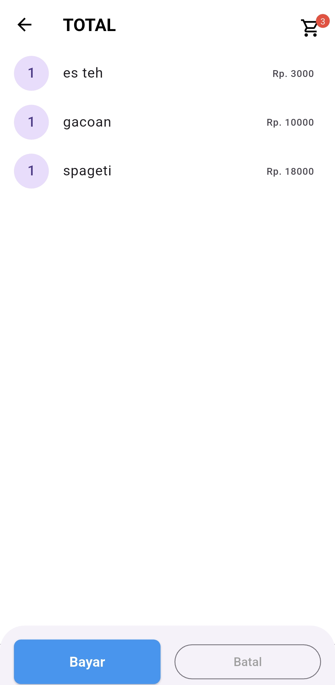
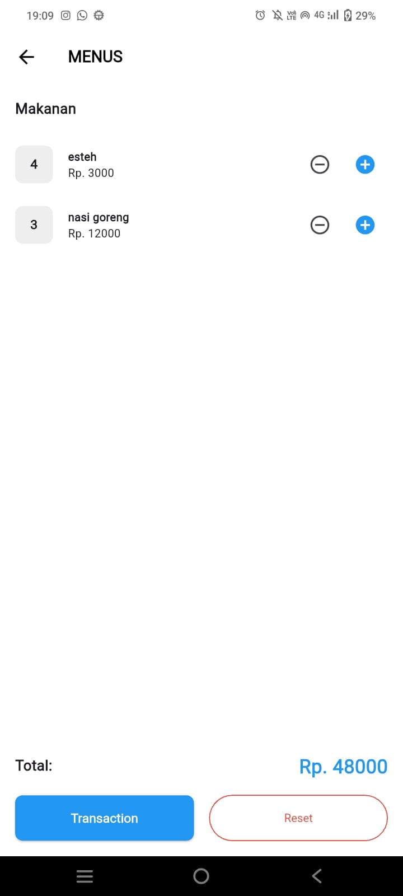

# Ujian Praktikum Flutter POS SQLite
**Nama Mahasiswa:** Galang Bagus Erkamta
**NIM:** 362458302015
**Kelompok:** 2

## Deskripsi Fitur yang Ditambahkan
1. menambahkan fitur menampilkan jumlah item di keranjang pada AppBar dengan badge.
2. Perbarui total harga secara real-time saat item ditambah/dikurangi
## File yang dimodifikasi
* lib/screen/pos/car_screen.dart -> menambahkan bagde jumlah item yang ada dikeranjang
* lib/screens/pos/pos_screen.dart ->  Perbarui total harga secara real-time saat item ditambah/dikurangi

## Screenshot kode program
fitur nomor 1

fitur nomor 2

## kendala yang dialami saat ujian
1.gagal saat menjalankan "flutter run" menggunakan device karena harus mengupdate beberapa file didalam android bagian gradle. setelah beberapa kali diubah akhirnya berhasil. 